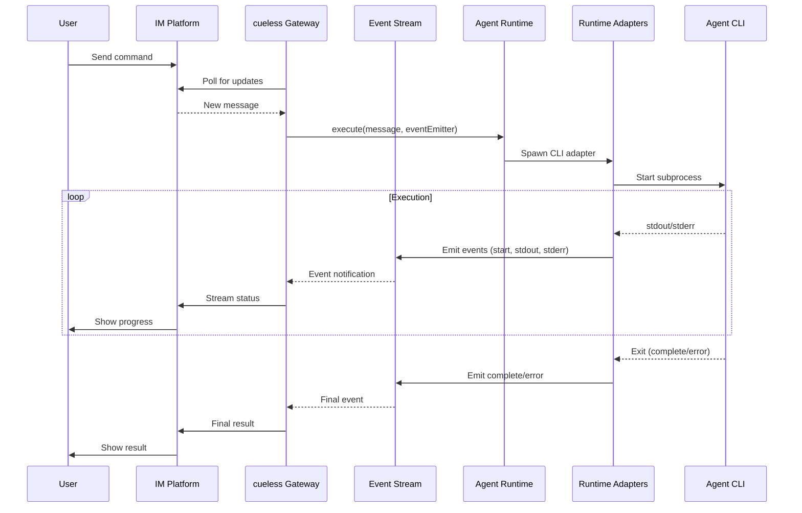

# Bootstrap Cueless

> **Status**: complete · **Priority**: high · **Created**: 2026-01-28
> **North Star**: cueless is the control plane between human intent and autonomous agents — delivered through IM.

## Overview

Build a minimal IM-first control layer that receives IM messages from various platforms (Telegram, Slack), dispatches them to swappable agent runtimes, and streams execution status back via IM.

**Constraints:**
- IM is a control surface, not a chat UI
- One message → one execution → one agent
- Stateless per command, no long-term memory, no multi-agent planning
- Agent runtime must be swappable without changing IM logic

## Design

High-level design details and flow are outlined below.

### Architecture



### Components

1. **IM Gateway** (`/src/gateway/`)
   - Abstract IM adapter interface
   - Pluggable providers with connection methods:
     - **Telegram**: Long polling (no public endpoint)
     - **Slack**: Socket Mode/WebSocket (no public endpoint) or Events API (webhooks)
   - Message validation & auth
   - Response formatter

2. **Agent Runtime Interface** (`/src/runtime/`)
   - Abstract interface: `execute(message, eventEmitter)`
   - Pluggable CLI adapters (claude code, codex-cli, opencode, copilot-cli, gemini-cli)
   - Spawn subprocess with stdin/stdout streaming
   - Lifecycle events: `start`, `stdout`, `stderr`, `complete`, `error`

3. **Event Stream** (`/src/events/`)
   - Pub/sub for execution status
   - IM Gateway subscribes to user-specific events
   - Streams back to Telegram

### Execution States

```
received → executing → streaming → complete
    │          │           │
    └──────────┴───────────┴───────────▶ error
```

Explicit states prevent hidden reasoning exposure.

### Data Flow

1. User sends: "deploy website to staging"
2. Gateway polls IM platform → receives message → validates
3. Gateway sends raw message to configured agent runtime (claude code, codex-cli, opencode, copilot-cli, gemini-cli, etc.)
4. Runtime streams execution events via stdout/stderr
5. Gateway captures events and streams to user's IM platform
6. Result returned when runtime exits

## Plan

Phased execution checklist for the v0 bootstrap.

### Phase 1: Core Skeleton
- [x] Project structure with TypeScript
- [x] Configuration system (env vars)
- [x] Event bus implementation
- [x] Basic logging

### Phase 2: IM Gateway
- [x] Abstract IM adapter interface
- [x] Telegram adapter (long polling, v0 default)
- [x] Message parsing (text, chat_id, user)
- [x] Response sender

### Phase 3: Runtime Interface
- [x] Abstract Runtime interface: `execute(message, eventEmitter)`
- [x] Runtime adapter pattern (claude code, codex-cli, opencode, copilot-cli, gemini-cli)
- [x] Spawn agent CLI as subprocess with stdin/stdout
- [x] Event lifecycle hooks: `start`, `stdout`, `stderr`, `complete`, `error`
- [x] Node.js runtime implementation (mock agent)

### Phase 4: Integration
- [x] End-to-end flow test
- [x] Docker setup
- [x] README with usage

## Test

- [x] IM platform receives new messages (Telegram in v0)
- [x] Invalid credentials rejected
- [x] Raw message passed to configured agent runtime
- [x] Runtime adapter streams stdout/stderr to IM platform
- [x] Runtime swap (claude code → codex-cli → opencode) via env var
- [x] Concurrent executions are isolated (stateless)

## Implementation Notes

- TypeScript project scaffolded with a swappable IM adapter (`telegram` or `mock`) and runtime (`mock` or `cli`).
- Event stream implemented with `eventemitter3` and per-execution filtering in the gateway.
- CLI runtime uses a shell command (`RUNTIME_COMMAND`) and streams stdout/stderr back to IM.
- Dockerfile builds and runs the compiled service for deployment.

## Notes

**Tech Stack:**
- Node.js + TypeScript (faster iteration for v0)
- Fastify (lightweight HTTP, if needed for webhooks)
- EventEmitter3 (event bus)
- IM clients: node-telegram-bot-api (v0), @slack/bolt, @microsoft/microsoft-graph-client

**Trade-offs:**
- No persistence: in-memory only
- Single runtime active at a time (env var switch)
- Telegram only in v0 (other providers via abstraction layer)

**Future considerations:**
- Add SQLite for basic metrics (not state)
- Runtime discovery via filesystem/plugins
- Rate limiting per user
- Slack adapter
