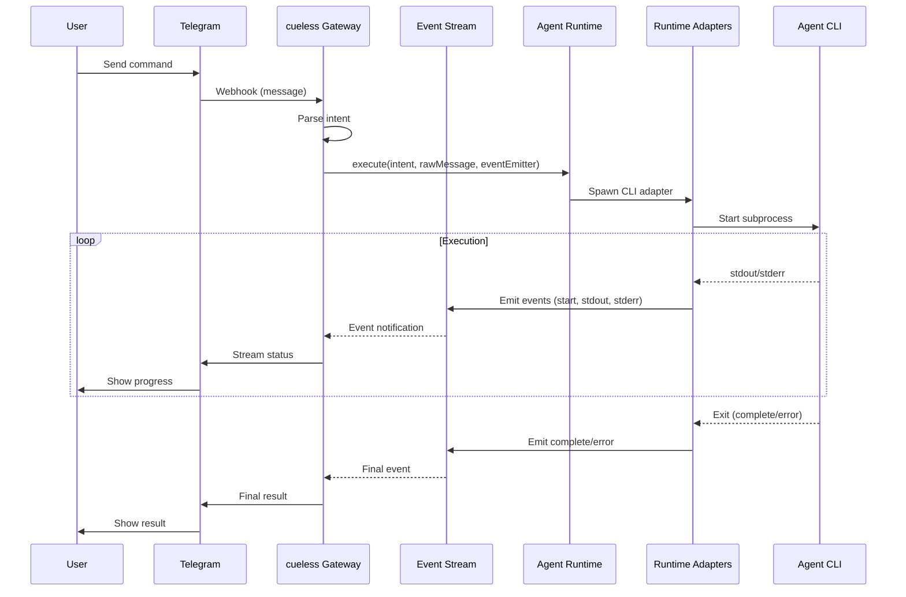

# Bootstrap Cueless

> **Status**: planned · **Priority**: high · **Created**: 2026-01-28
> **North Star**: cueless is the control plane between human intent and autonomous agents — delivered through IM.

## Overview

Build a minimal IM-first control layer that receives Telegram messages, converts them to structured intents, dispatches to swappable agent runtimes, and streams execution status back via IM.

**Constraints:**
- IM is a control surface, not a chat UI
- One message → one execution → one agent
- Stateless per command, no long-term memory, no multi-agent planning
- Agent runtime must be swappable without changing IM logic

## Design

### Architecture



### Components

1. **IM Gateway** (`/src/gateway/`)
   - Telegram webhook handler
   - Message validation & auth
   - Response formatter

2. **Intent Parser** (`/src/intent/`)
   - Raw message → structured intent
   - Intent schema: `{ id, userId, command, params, timestamp }`
   - All intents route directly to agent runtime (no routing layer)

3. **Agent Runtime Interface** (`/src/runtime/`)
   - Abstract interface: `execute(intent, rawMessage, eventEmitter)`
   - Pluggable CLI adapters (claude code, codex-cli, opencode, copilot-cli, gemini-cli)
   - Spawn subprocess with stdin/stdout streaming
   - Lifecycle events: `start`, `stdout`, `stderr`, `complete`, `error`

4. **Event Stream** (`/src/events/`)
   - Pub/sub for execution status
   - IM Gateway subscribes to user-specific events
   - Streams back to Telegram

### Execution States

```
received → parsing → executing → streaming → complete
    │           │        │           │
    └───────────┴────────┴───────────┴───────────▶ error
```

Explicit states prevent hidden reasoning exposure.

### Data Flow

1. User sends: "/deploy website to staging"
2. Gateway receives webhook → validates
3. Intent Parser extracts: `{ command: "deploy", target: "website", env: "staging" }`
4. Gateway sends intent + raw message to configured agent runtime (claude code, codex-cli, opencode, copilot-cli, gemini-cli, etc.)
5. Runtime streams execution events via stdout/stderr
6. Gateway captures events and streams to user's Telegram
7. Result returned when runtime exits

## Plan

### Phase 1: Core Skeleton
- [ ] Project structure with TypeScript
- [ ] Configuration system (env vars)
- [ ] Event bus implementation
- [ ] Basic logging

### Phase 2: IM Gateway
- [ ] Telegram webhook endpoint (`POST /webhook`)
- [ ] Bot token validation
- [ ] Message parsing (text, chat_id, user)
- [ ] Response sender

### Phase 3: Intent System
- [ ] Intent schema definition (includes raw message for runtime context)
- [ ] Simple keyword parser (v0: no NLP)
- [ ] Validation middleware

### Phase 4: Runtime Interface
- [ ] Abstract Runtime interface: `execute(intent, rawMessage, eventEmitter)`
- [ ] Runtime adapter pattern (claude code, codex-cli, opencode, copilot-cli, gemini-cli)
- [ ] Spawn agent CLI as subprocess with stdin/stdout
- [ ] Event lifecycle hooks: `start`, `stdout`, `stderr`, `complete`, `error`
- [ ] Node.js runtime implementation (mock agent)

### Phase 5: Integration
- [ ] End-to-end flow test
- [ ] Docker setup
- [ ] README with usage

## Test

- [ ] Telegram webhook receives message and returns 200
- [ ] Invalid bot token rejected
- [ ] Message parsed into valid intent structure
- [ ] All messages route to configured agent runtime
- [ ] Runtime adapter streams stdout/stderr to Telegram
- [ ] Runtime swap (claude code → codex-cli → opencode) via env var
- [ ] Concurrent executions are isolated (stateless)

## Notes

**Tech Stack:**
- Node.js + TypeScript (faster iteration for v0)
- Fastify (lightweight HTTP)
- EventEmitter3 (event bus)
- node-telegram-bot-api (Telegram client)

**Trade-offs:**
- No NLP in v0: simple keyword matching
- No persistence: in-memory only
- Single runtime active at a time (env var switch)

**Future considerations:**
- Add SQLite for basic metrics (not state)
- Runtime discovery via filesystem/plugins
- Rate limiting per user
