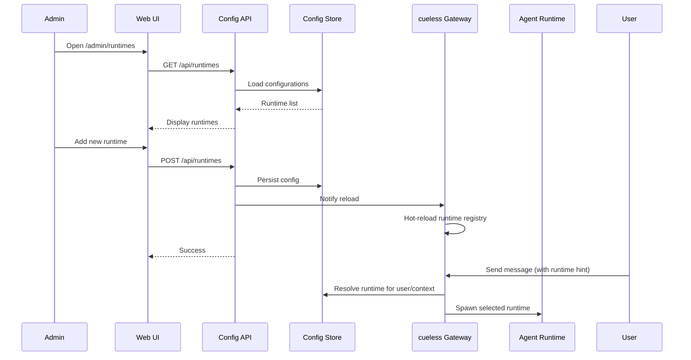

# Runtime Config Web UI

> **Status**: planned · **Priority**: high · **Created**: 2026-01-28  
> **North Star**: Replace hardcoded env vars with a proper web UI for managing agent runtimes at scale

## Overview

Currently, agent runtime configuration is hardcoded via environment variables (`RUNTIME_TYPE`, `RUNTIME_COMMAND`, `RUNTIME_WORKING_DIR`, `RUNTIME_TIMEOUT_MS`). This approach:
- Requires service restart to change configuration
- Only supports a single runtime configuration at a time
- Has no visibility into available runtimes
- Makes multi-tenant or multi-runtime scenarios impossible

This spec introduces a web-based configuration UI that allows dynamic runtime management, enabling multiple runtimes, hot-reloading without restart, and better operational visibility.

**Constraints:**
- Must not break existing env var fallback (backward compatible)
- Web UI is for configuration, not real-time chat (IM remains control surface)
- Runtime changes should be dynamic (no restart required)
- Professional UI/UX comparable to Vercel, Supabase, Linear

## Design

### Architecture



### Components

1. **Configuration Store** (`/src/config/store.ts`)
   - Interface: `load()`, `save()`, `list()`, `get(id)`, `delete(id)`
   - Default implementation: SQLite (lightweight, file-based)
   - Schema: `runtimes` table with id, name, type, command, workingDir, timeoutMs, isDefault, metadata JSON

2. **Config API** (`/src/api/config.ts`)
   - REST endpoints under `/api/runtimes`
   - GET /api/runtimes - list all
   - GET /api/runtimes/:id - get specific
   - POST /api/runtimes - create new
   - PUT /api/runtimes/:id - update
   - DELETE /api/runtimes/:id - remove
   - POST /api/runtimes/:id/activate - set as default
   - Hot-reload notification to Gateway via EventBus

3. **Web UI** (`apps/web/app/(admin)/runtimes/`)
   - Next.js 15 App Router with modern stack (see spec 003)
   - Runtimes list page with data table (sortable, filterable)
   - Add/Edit runtime with dialog/modal forms
   - Set default runtime with switch toggle
   - Test runtime with inline terminal output
   - Professional dark theme UI (shadcn/ui components)

4. **Runtime Registry** (`/src/runtime/registry.ts`)
   - Maintains in-memory map of available runtimes
   - Subscribes to config changes via EventBus
   - Hot-swaps runtime without restart
   - Falls back to env vars if no DB config exists

5. **Gateway Updates** (`/src/gateway/gateway.ts`)
   - Uses RuntimeRegistry instead of single runtime instance
   - Resolves runtime based on: user preference → context hint → default
   - Supports runtime hint in message metadata (e.g., "/use:codex deploy site")

### Data Model

```typescript
interface RuntimeConfig {
  id: string;              // UUID
  name: string;            // Display name (e.g., "Claude Code", "Codex")
  type: 'mock' | 'cli';    // Runtime type
  command: string;         // Shell command to execute
  workingDir?: string;     // Working directory (optional)
  timeoutMs: number;       // Execution timeout
  envVars?: Record<string, string>; // Additional env vars
  isDefault: boolean;      // Whether this is the default runtime
  createdAt: Date;
  updatedAt: Date;
}

interface RuntimeRegistry {
  getDefault(): RuntimeConfig;
  getById(id: string): RuntimeConfig | undefined;
  getByName(name: string): RuntimeConfig | undefined;
  list(): RuntimeConfig[];
  reload(): Promise<void>;
}
```

### Execution Flow

```
User Message → Gateway → Resolve Runtime → Spawn from Registry → Execute
                     ↑
            RuntimeRegistry (hot-reloadable)
                     ↑
            Config Store (SQLite) + Env Var Fallback
```

## Plan

### Phase 1: Config Store Foundation
- [ ] Create SQLite schema for runtime_configs table
- [ ] Implement ConfigStore interface with SQLite backend
- [ ] Migration from env vars: on first start, auto-create runtime from existing env vars
- [ ] Add `lean-spec` CLI command to seed initial runtimes

### Phase 2: Runtime Registry
- [ ] Create RuntimeRegistry class with hot-reload capability
- [ ] Refactor Gateway to use RuntimeRegistry instead of single runtime
- [ ] Add EventBus message for config changes (`config:runtime:changed`)
- [ ] Ensure backward compatibility: if no DB configs, fallback to env vars

### Phase 3: Config API
- [ ] Add Fastify routes under `/api/runtimes`
- [ ] Implement CRUD operations
- [ ] Add validation middleware
- [ ] Add hot-reload trigger on mutations
- [ ] Add health check endpoint `/api/health`

### Phase 4: Web UI (Next.js)
- [ ] Create `/runtimes` page with data table component
- [ ] Implement runtime cards with status badges
- [ ] Build add/edit runtime dialog with form validation (Zod)
- [ ] Add "Set as default" switch with optimistic updates
- [ ] Create test runtime flow with terminal output display
- [ ] Add delete confirmation dialog
- [ ] Implement search and filtering
- [ ] Add empty state illustration
- [ ] Wire up React Query for API integration

### Phase 5: User Runtime Selection
- [ ] Support runtime hint in message: `/runtime:claude deploy site`
- [ ] Add per-user default runtime preference (store in SQLite)
- [ ] Gateway resolves runtime: hint → user pref → global default

### Phase 6: Polish
- [ ] Add basic auth to web UI (simple token or env var)
- [ ] Add runtime execution metrics (success/fail counts)
- [ ] Docker compose update with volume for SQLite

## Test

- [ ] Runtime config persists in SQLite after restart
- [ ] Hot-reload: changing runtime config doesn't require service restart
- [ ] Backward compatibility: works without DB (env vars only)
- [ ] Multiple runtimes can be configured simultaneously
- [ ] Gateway correctly routes to selected runtime based on hint/preference/default
- [ ] Web UI is accessible at `/runtimes` with professional design
- [ ] UI matches design system (dark theme, proper spacing, typography)
- [ ] All interactions have proper loading and error states
- [ ] Forms validate input before submission (Zod)
- [ ] API returns 400 for invalid runtime configs (empty command, negative timeout)
- [ ] Concurrent executions with different runtimes are isolated

## Notes

**Why SQLite over other stores?**
- Zero external dependencies (file-based)
- Sufficient for configuration data (not high-throughput)
- Easy backups (single file)
- Works in Docker volumes

**Migration Strategy:**
1. On first startup, check if runtime_configs table exists
2. If empty, read `RUNTIME_COMMAND` etc. from env and insert as "Default Runtime"
3. Mark as default (`isDefault: true`)
4. Future: env vars become fallback only

**Security Considerations:**
- Web UI should have basic auth (token in env var)
- Command validation: prevent dangerous commands? (maybe warn only)
- Working directory validation: ensure within allowed paths?

**UI/UX Standards:**
- Follow design system from spec 003 (Next.js + shadcn/ui + Tailwind)
- Use data table for list views (sortable columns, pagination)
- Dialogs for create/edit operations
- Toast notifications for success/error feedback
- Skeleton loaders during data fetching
- Keyboard shortcuts (cmd+k for search, escape to close dialogs)

**Future Enhancements:**
- Runtime templates (pre-configured for claude, codex, opencode)
- Runtime health checks with visual status indicators
- Execution history with filtering and export
- Runtime usage analytics dashboard
- Git sync for config (store runtimes in repo)
- Real-time updates via WebSocket
